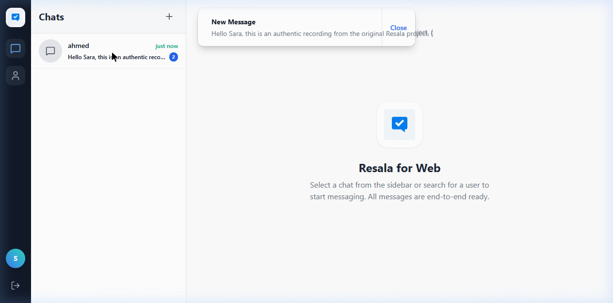
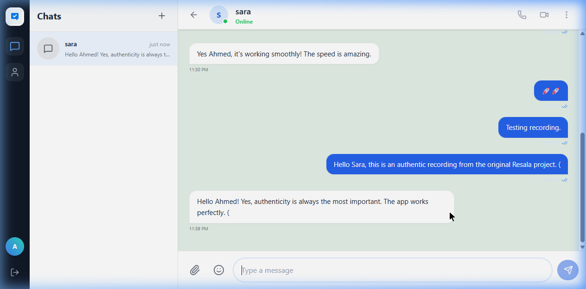
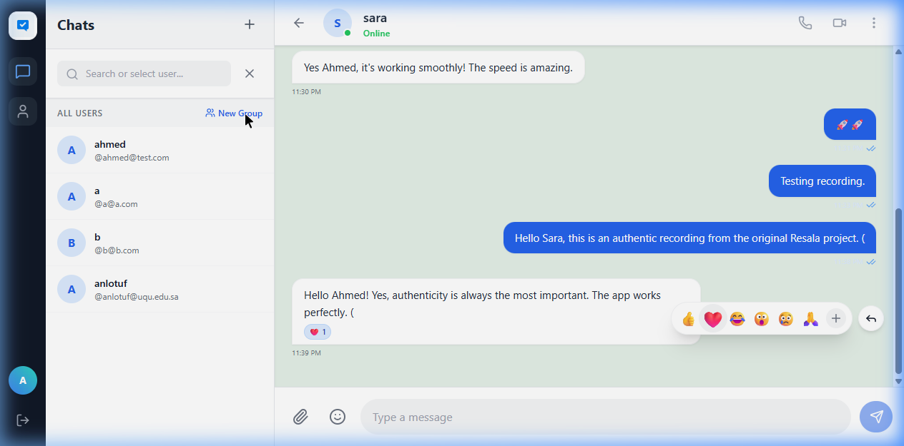

# Resala - رسالة 🚀


[](https://dotnet.microsoft.com/download)
[](https://reactjs.org/)
[](https://www.docker.com/)


**Resala** (Arabic for "Message") is a modern, real-time messaging application designed for organizations and individuals. It provides a sleek, responsive interface for seamless communication, featuring group chats, file sharing, and advanced authentication options—all running in a secure, on-premise environment within the organization's own servers.

**مشروع رسالة** هو تطبيق مراسلة فوري حديث ومتقدم مصمم للمؤسسات والأفراد. يوفر واجهة مستخدم سلسة واستجابة سريعة للتواصل الفعال، مع ميزات متقدمة تشمل المحادثات الجماعية، مشاركة الملفات، وخيارات مصادقة متطورة، وكل ذلك في بيئة آمنة داخل خوادم المنشأة.

---

## 💡 لماذا رسالة؟ (Why Resala?)

جاء مشروع **رسالة** ليعالج الفجوة في تطبيقات المراسلة الحديثة التي تفتقر للخصوصية الكاملة في بيئات العمل الحساسة. نحن نؤمن بـ:

- **🔒 السيادة الرقمية (On-premise)**: مشروعنا مصمم ليتم تنصيبه محلياً داخل خوادم المنشأة، مما يضمن أن بياناتك ومحادثاتك لا تغادر أسوار مؤسستك أبداً.
- **🛠️ شفافية كاملة (Open Source)**: الكود المصدري متاح للجميع للمراجعة، التطوير، والتأكد من عدم وجود أي ثغرات أو أبواب خلفية.
- **🛡️ أمان وخصوصية بمستوى مؤسساتي**: تكامل عميق مع أنظمة الـ Active Directory (LDAP) لضمان تحكم كامل في هويات المستخدمين وصلاحياتهم.
- **🚀 تواصل فوري بلا قيود**: تقديم تجربة مستخدم تضاهي التطبيقات السحابية العالمية ولكن بملكية كاملة لك.

---

## 📸 لقطات من داخل المشروع (Project Screenshots)

<p align="center">
  
  <br>
  <em>واجهة المحادثة الفورية وتجربة المستخدم السلسة</em>
</p>

<p align="center">
  
  
  <br>
  <em>دعم التفاعلات (Emojis) وميزات المجموعات المتقدمة</em>
</p>

---


## 🌟 مميزات المشروع (Features)

- **💬 Real-time Messaging**: محادثات فورية وسريعة لضمان تسليم الرسائل والتحديثات في وقتها الحقيقي (Real-time bi-directional communication).
- **👥 Group Chats**: إنشاء غرف دردشة جماعية مع إمكانية تخصيص صور المجموعات.
- **🌐 Multilingual (i18n)**: دعم كامل للغتين العربية والإنجليزية مع واجهة مستخدم متجاوبة (RTL/LTR).
- **🔐 Flexible Authentication**: دعم نظامين للمصادقة (**AuthMode**):
  - **Standalone**: نظام مستقل تماماً مع إمكانية التسجيل وتسجيل الدخول المباشر.
  - **LDAP (Active Directory)**: التكامل مع أنظمة الشركات عبر **Active Directory** باستخدام مكتبة Novell، مما يضمن العمل بسلاسة على بيئات Linux و Windows.
- **📂 Shared Files**: تبويب خاص للملفات المشتركة داخل المحادثات لسهولة الوصول إليها.
- **🔔 Smart Notifications**: مؤشرات للرسائل غير المقروءة في القائمة الجانبية وفي عنوان المتصفح.
- **🐳 Docker Support**: سهولة النشر والتشغيل باستخدام Docker و Docker Compose.
- **🎨 Modern UI**: تصميم عصري وبسيط يركز على تجربة المستخدم (UX).

---

## 🛠️ طريقة التثبيت (Installation)

يمكن تشغيل المشروع بطريقتين:

### الإعدادات (Configuration)
يمكن التحكم في سلوك النظام عبر المتغيرات البيئية (Environment Variables) في ملف `docker-compose.yml`:
- `AuthMode`: يمكن ضبطه على `Standalone` للحسابات المحلية أو `LDAP` للربط مع Active Directory.
- `ConnectionStrings__DefaultConnection`: نص الاتصال بقاعدة البيانات.

### الخيار الأول: استخدام Docker (الموصى به)
1. تأكد من تثبيت **Docker** و **Docker Compose**.
2. من المجلد الرئيسي للمشروع، قم بتشغيل الأمر التالي:
   ```bash
   docker-compose up --build -d
   ```
3. سيتم تشغيل:
   - واجهة المستخدم (Frontend) على: `http://localhost:5173`
   - الواجهة البرمجية (API) على: `https://localhost:5001`
   - قاعدة البيانات (PostgreSQL) على المنفذ: `5432`

### الخيار الثاني: التشغيل اليدوي (Manual)
#### المتطلبات:
- **.NET SDK 9.0**
- **Node.js 20+**
- **PostgreSQL 15+**

1. **شهادة SSL للمتصفح**: لتشغيل الـ API بشكل آمن وتجنب مشاكل الاتصال (CORS/Authentication)، يجب توثيق الشهادة المحلية:
   ```bash
   dotnet dev-certs https --trust
   ```
2. **قاعدة البيانات**: قم بإنشاء قاعدة بيانات باسم `resala_chat` وحدث نص الاتصال في `appsettings.json`.
3. **البكند (Backend)**:
   ```bash
   cd src/Resala.Backend
   dotnet run
   ```
4. **الفرونت (Frontend)**:
   ```bash
   cd src/resala.client
   npm install
   npm run dev
   ```
---

## 🧪 الاختبارات (Testing)

يتضمن المشروع وحدة اختبارات (Unit Tests) للتأكد من جودة وسلامة الكود وضمان استقرار النظام وتوافقه مع المتطلبات البرمجية.

### تشغيل الاختبارات (Running Tests):
يمكنك تشغيل كافة الاختبارات باستخدام الأمر التالي من المجلد الرئيسي للمشروع:
```bash
dotnet test
```

أو تشغيل مشروع الاختبارات بشكل مخصص:
```bash
dotnet test src/Resala.Tests
```

---

## 🚀 المميزات القادمة (Upcoming Features)

نعمل حالياً على إضافة الميزات التالية في التحديثات القادمة:
- [ ] **📞 Voice & Video Calls**: مكالمات صوتية ومرئية عالية الجودة.
- [ ] **🔒 End-to-End Encryption**: تشفير الرسائل من الطرف إلى الطرف لزيادة الأمان.
- [ ] **🔍 Advanced Search**: محرك بحث متقدم للرسائل والملفات داخل المحادثات القديمة.
- [ ] **📊 Statistics Dashboard**: لوحة تحكم للمسؤولين لمتابعة نشاط النظام.
- [ ] **📱 Mobile App**: تطبيق خاص للهواتف الذكية (iOS & Android).
---

## 🤝 المساهمة (Contributing)

نرحب بجميع المساهمات لتطوير مشروع "رسالة"! يمكنك المساهمة من خلال:
1. عمل **Fork** للمشروع.
2. إنشاء فرع جديد لميزتك (**Feature Branch**): `git checkout -b feature/AmazingFeature`.
3. حفظ التغييرات (**Commit**): `git commit -m 'Add some AmazingFeature'`.
4. رفع الفرع (**Push**): `git push origin feature/AmazingFeature`.
5. فتح طلب سحب (**Pull Request**).

كما يمكنك الإبلاغ عن الأخطاء (Bugs) أو اقتراح ميزات جديدة عبر قسم **Issues**.

---

## 📝 الترخيص (License)
هذا المشروع متاح للاستخدام تحت رخصة [MIT](LICENSE).

---

> [!IMPORTANT]
> **Preview Version / نسخة معاينة**
> This project is currently in **Preview**. Expect significant changes and updates.
> هذا المشروع لا يزال في مرحلة **المعاينة (Preview)**. قد تطرأ تغييرات وتحديثات جذرية.

---

**تم التطوير بكل ❤️ لجعل التواصل أسهل.**
**Developed with ❤️ to make communication easier.**
