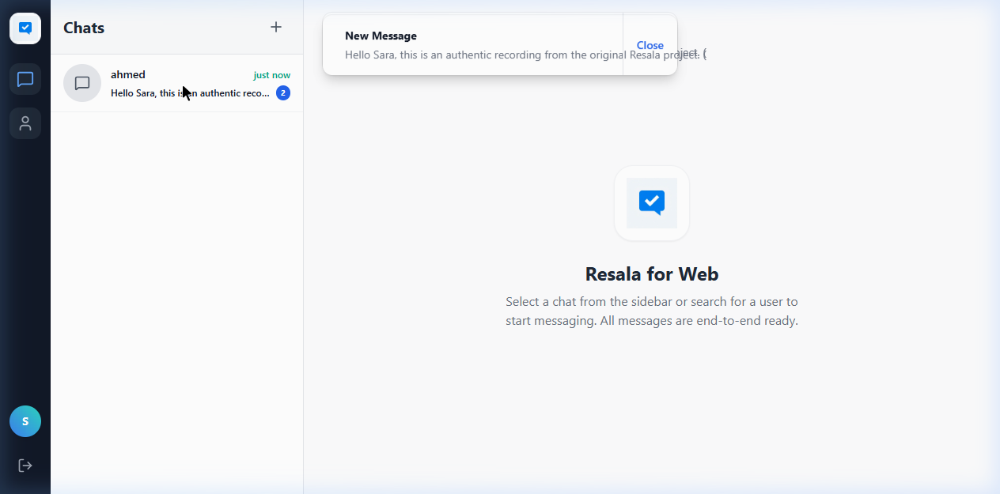
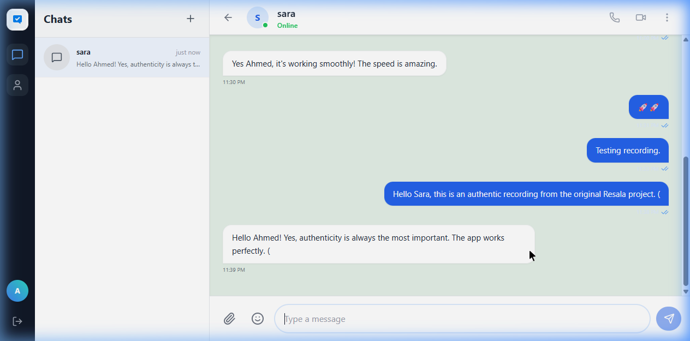
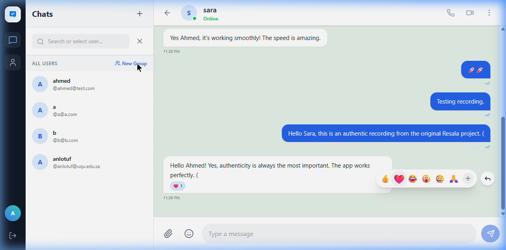

# Resala 🚀

[](https://dotnet.microsoft.com/download)
[](https://reactjs.org/)
[](https://www.docker.com/)

**Resala** (meaning "Message" in Arabic) is a modern, real-time messaging application designed for organizations and individuals. It provides a sleek, responsive interface for seamless communication, featuring group chats, file sharing, and advanced authentication options—all running in a secure, on-premise environment within the organization's own servers.

---

## 💡 Why Resala?

Resala was created to address the need for modern messaging applications that lack complete privacy control in sensitive work environments. We believe in:

- **🔒 Digital Sovereignty (On-premise)**: Our project is designed to be deployed locally within your organization's servers, ensuring your data and conversations never leave your premises.
- **🛠️ Full Transparency (Open Source)**: The source code is open for everyone to review, develop, and verify that there are no backdoors or vulnerabilities.
- **🛡️ Enterprise-Grade Security & Privacy**: Deep integration with Active Directory (LDAP) systems to ensure complete control over user identities and permissions.
- **🚀 Real-Time Communication Without Boundaries**: A user experience that rivals global cloud messaging services while remaining fully owned by you.

---

## 📸 Screenshots

<p align="center">
  
  <br>
  <em>Real-time chat interface with a seamless user experience</em>
</p>

<p align="center">
  
  
  <br>
  <em>Message reaction support (Emojis) and advanced group features</em>
</p>

---

## 🌟 Features

- **💬 Real-time Messaging**: Instant communication ensuring messages and updates are delivered in real time using bi-directional communication.
- **📞 Voice & Video Calls**: Implemented custom WebRTC video calling with hardware-accelerated background blur/segmentation features.
- **👥 Group Chats**: Create group rooms with custom avatars and members.
- **🌐 Multilingual (i18n)**: Out-of-the-box support for multiple languages including Arabic and English, with responsive RTL/LTR layout support.
- **🔐 Flexible Authentication**: Supports two authentication modes (**AuthMode**):
  - **Standalone**: Fully independent system with local registration and login.
  - **LDAP (Active Directory)**: Integrates with corporate LDAP directories using Novell library, operating seamlessly on Linux and Windows.
- **📂 Shared Files**: Accessible tab in chat views listing all shared files for quick lookup.
- **🔔 Smart Notifications**: Unread message indicators in the sidebar and dynamically updated browser titles.
- **🐳 Docker Support**: Easily build, configure, and run using Docker and Docker Compose.
- **🎨 Modern UI**: Modern, clean interface focused on details, premium user experience, and smooth interactions.

---

## 🛠️ Installation

The project can be run in two ways:

### Configuration
System behavior can be controlled via environment variables in `docker-compose.yml` or standard configuration files:
- `AuthMode`: Can be set to `Standalone` for local accounts or `LDAP` to connect with Active Directory.
- `ConnectionStrings__DefaultConnection`: Database connection string.

### Option 1: Docker (Recommended)
1. Ensure **Docker** and **Docker Compose** are installed.
2. From the project's root folder, run:
   ```bash
   docker-compose up --build -d
   ```
3. This spins up:
   - Frontend (React Client) on: `http://localhost:5173`
   - Backend API (ASP.NET Core) on: `https://localhost:5001`
   - Database (PostgreSQL) on port: `5432`

### Option 2: Manual Run
#### Prerequisites:
- **.NET SDK 9.0**
- **Node.js 20+**
- **PostgreSQL 15+**

1. **Trust Development SSL Certificate**: To run the secure API locally and avoid CORS/Auth issues, run:
   ```bash
   dotnet dev-certs https --trust
   ```
2. **Database Setup**: Create a PostgreSQL database named `resala_chat` and update the connection string in `appsettings.json` (or `appsettings.Development.json`).
3. **Backend Service**:
   ```bash
   cd src/Resala.Backend
   dotnet run
   ```
4. **Frontend Client**:
   ```bash
   cd src/resala.client
   npm install
   npm run dev
   ```

---

## 🧪 Testing

The repository contains unit tests to ensure stability, quality, and compatibility.

### Running Tests
To run all tests from the root directory, execute:
```bash
dotnet test
```

Or target the test project directly:
```bash
dotnet test src/Resala.Tests
```

---

## 🚀 Future Roadmap

We are continuously working on improving Resala. Planned features include:
- [x] **📞 Voice & Video Calls**: WebRTC calls with background blur filters.
- [ ] **🔒 End-to-End Encryption**: Secure client-to-client message encryption.
- [ ] **🔍 Advanced Search**: Advanced filtering and search for messages/files within historical logs.
- [ ] **📊 Admin Dashboard**: System analytics and utilization statistics for system administrators.
- [ ] **📱 Mobile Application**: Dedicated applications for iOS and Android.

---

## 🤝 Contributing

We welcome contributions to Resala! To contribute:
1. **Fork** the repository.
2. Create a new branch for your feature: `git checkout -b feature/AmazingFeature`.
3. Commit your changes: `git commit -m 'Add some AmazingFeature'`.
4. Push to your branch: `git push origin feature/AmazingFeature`.
5. Open a **Pull Request**.

You can also submit issues, feedback, or bugs under the **Issues** tab.

---

## 📝 License

This project is licensed under the [MIT License](LICENSE).

---

> [!IMPORTANT]
> **Preview Version**
> This project is currently in **Preview**. Expect updates and structural changes as we iterate.

---

**Developed with ❤️ to make communication easier.**
